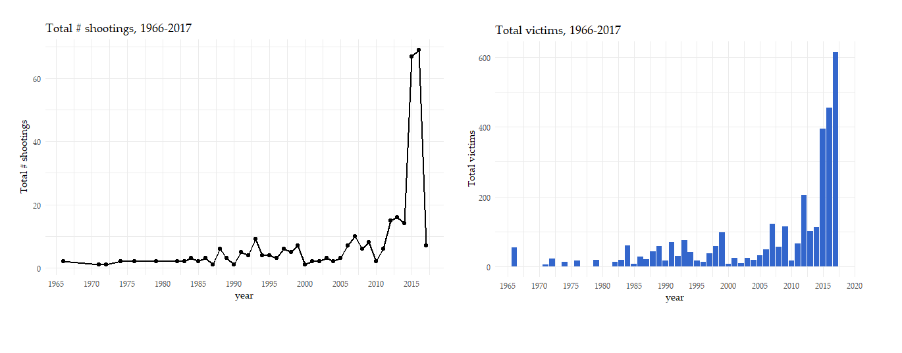

# US-Mass-Shootings: Data Visualization using R

This repository attempts to understand the much talked about mass shootings in the US, and how commonplace they have become. Using some of the powerful data visualization libraries that R provides, let us delve into understanding this phenomenon.

All the codes for visuals have been included in the R script. Sooner, than later, the R script will be converted to an R shiny script so that one can just run the script to view a Shiny dashboard.

### A. Overall trends: Number of shootings and victims from 1970s to today

Pretty evident from the trend that over the last decade or two, number of incidents have been on the rise.

