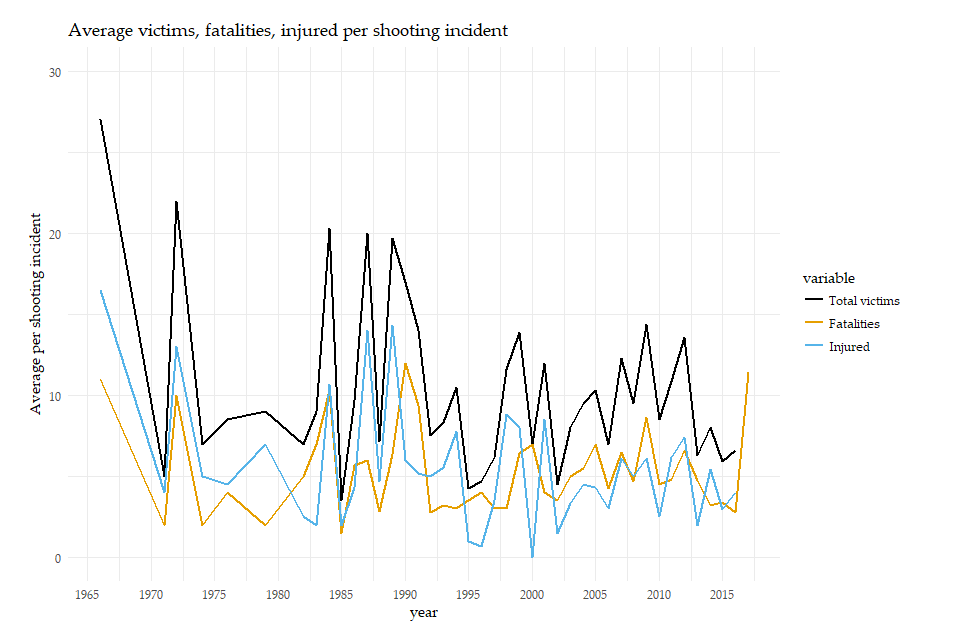
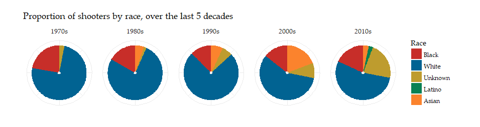

# US-Mass-Shootings: Data Visualization using R

This repository attempts to understand the worrying mass shootings trends in the US, and how commonplace they have become. Using some of the powerful data visualization libraries that R provides, let us delve into understanding this phenomenon better.

All the codes for visuals have been included in the R script. Sooner, than later, the R script will be converted to an R shiny script so that one can just run the script to view charts on an interactive Shiny dashboard.

### A. Overall trends: Number of shootings and victims from 1970s to today
Pretty evident from the trend that over the last decade or two, number of incidents have been on the rise. The spike in 2017 comes from the latest shooting of October 02 in Las Vegas.

An analysis by month, year and type of casualty caused reveals that these shootings are spread out across the year uniformly, without any form of concentration or localization within specific months (I was hoping summers meant more shootings)

What is interesting to note is that although incidents of mass shootings have been on the rise, the average number of casualties caused by these incidents show a somewhat downward trend. From the below chart, one can see that shootings were bigger pre-1990s (with ~20 casualties per shooting incident), while that number has dropped to 13-15 over the last couple of decades. PS: Not attempting to console/soothe.

### B. Race based analysis
A decade-wise plot of proportion of shooters by their race reveals some very interesting insights. Look at the proportion of whites among shooters. 70s and 80s comprised pre-dominantly white shooters while that proportion has gone down over the years. However, whites are still the predominant one.

Plot of average casualties caused by race. Whites cause the most casualties (even Asians, but % of shootings caused by Asians is very low). However, the average casualty count has declined for white shooters, while for other races it has remained constant.

### C. Geography wise spread
A higher proportion of shootings are concentrated on the North-east and the East coast of US, with not many on the West coast, and very few in the Mid or Mid-West. Coming up: analysis by states

### D. Where do these shootings mostly occur?
A chilling analysis of the words associated with these shootings, very unfortunately, reveals that many of the shootings happen in schools, universities, and colleges. Sad, but true

These are some of the major insights. In summmary - 
1. Shootings and # of victims have risen recently, although
2. Avg. # of casualties per shooting seems to be on a downward trend (ignoring the Oct 02 Vegas shooting)
3. White shooters comprise the pre-dominant category while the average casualties caused by them is on the decline
4. These shoots are observed a lot more on the East coast than on any other part of the US, and
5. Schools, Universities, Colleges are the main centers where these incidents have been reported
